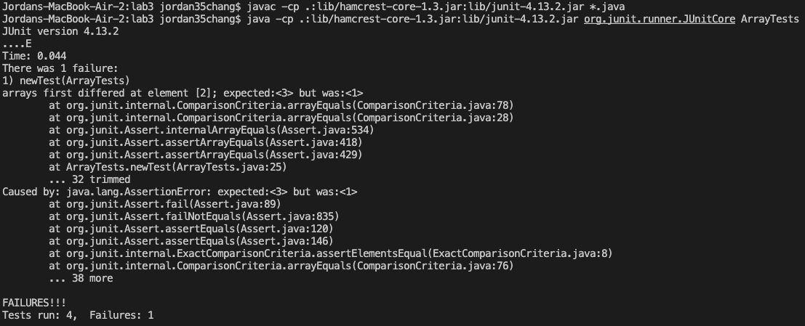

# Part 1
## Code for StringServer:

## /add-message being used:
.png)
In this screenshot, my handleRequest method is being called. In this method, the if argument is being run in handleRequest, and the relevant fields are url(more specifically the path), parameters, and list; with their values being "/add-message?s=Hello", "Hello", and "" before being run through. After being ran, the values of url and parameters stay the same since the method does not have any arguments that would adjust their values. However, the value of list gets changed to "Hello\n" since the method handleRequest updates what list contains.
.png)
In this screenshot, my handleRequest method is being called. In this method, the if argument is being run in handleRequest, and the relevant fields are url(more specifically the path), parameters, and list; with their values being "/add-message?s=How%20are%20you", "How%20are%20you", and "Hello\n" before being run through. After being ran, the values of url and parameters stay the same since the method does not have any arguments that would adjust their values. However, the value of list gets changed to "Hello\nHow are you\n" since the method handleRequest updates what list contains.

# Part 2
## (Using the bug from reverseInPlace)
## Failure-Inducing Input:
The method:
```
static void reverseInPlace(int[] arr) {
    for(int i = 0; i < arr.length; i += 1) {
      arr[i] = arr[arr.length - i - 1];
    }
  }
```
The failure-inducing input:
```
@Test
  public void newTest(){
    int[] input2 = {3,2,1};
    ArrayExamples.reverseInPlace(input2);
    assertArrayEquals(new int[]{1,2,3}, input2);
  }
```
A non failure-inducing input:
```
@Test 
  public void testReverseInPlace() {
    int[] input1 = { 3 };
    ArrayExamples.reverseInPlace(input1);
    assertArrayEquals(new int[]{ 3 }, input1);
	}
```
## The symptom:


## The Bug:
Before:
```
static void reverseInPlace(int[] arr) {
    for(int i = 0; i < arr.length; i += 1) {
      arr[i] = arr[arr.length - i - 1];
    }
  }
```
After:
```
static void reverseInPlace(int[] arr) {
    for(int i = 0; i < arr.length/2; i += 1) {
      int temp = arr[i];
      arr[i] = arr[arr.length - i - 1];
      arr[arr.length - i - 1] = temp;
    }
  }
```
This fixes the issue because the method previously had a for loop that would go the full length of the array, which as a result would reverse the array, and then reverse it again, resulting in the array being in the same order. In order to fix this, the for loop must span half the length of the array, and there also has to be a variable holding the current value in the array, in order to reverse properly.
# Part 3
From the lab in week 2, I learned more about how code can be used in urls. Prior to the lab, I never really thought about how urls actually functioned, so being able to woirk with code that can adjust the output of a url based on the queries provided was interesting and useful.
