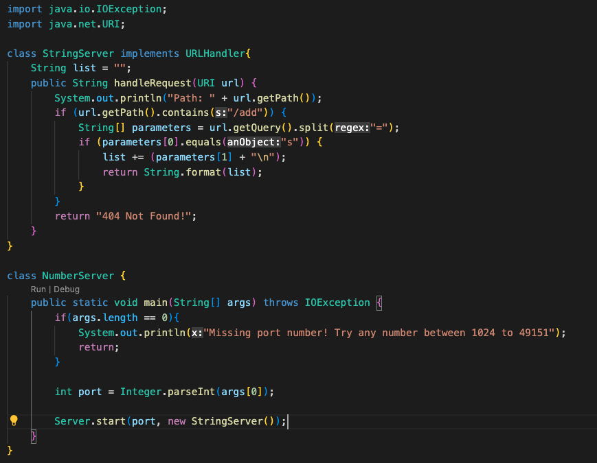

# Part 1
## Code for StringServer:

## /add-message being used:
.png)
In this screenshot, my handleRequest method is being called. In this method, the if argument is being run in handleRequest, and the relevant fields are url(more specifically the path), parameters, and list; with their values being "/add-message?s=Hello", "Hello", and "" before being run through. After being ran, the values of url and parameters stay the same since the method does not have any arguments that would adjust their values. However, the value of list gets changed to "Hello\n" since the method handleRequest updates what list contains.
.png)
In this screenshot, my handleRequest method is being called. In this method, the if argument is being run in handleRequest, and the relevant fields are url(more specifically the path), parameters, and list; with their values being "/add-message?s=How%20are%20you", "How%20are%20you", and "Hello\n" before being run through. After being ran, the values of url and parameters stay the same since the method does not have any arguments that would adjust their values. However, the value of list gets changed to "Hello\nHow are you\n" since the method handleRequest updates what list contains.
